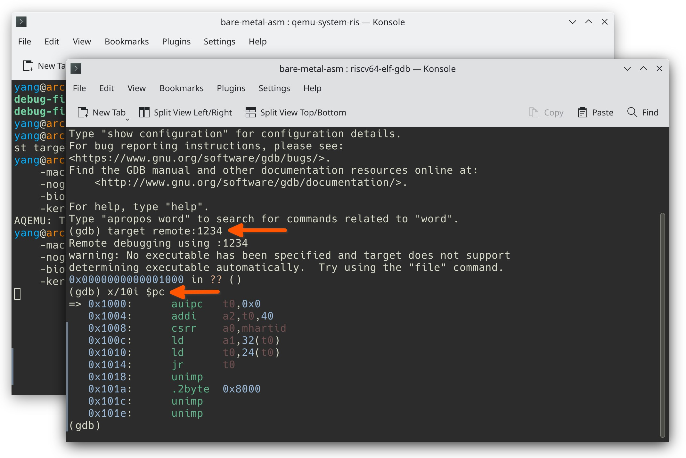
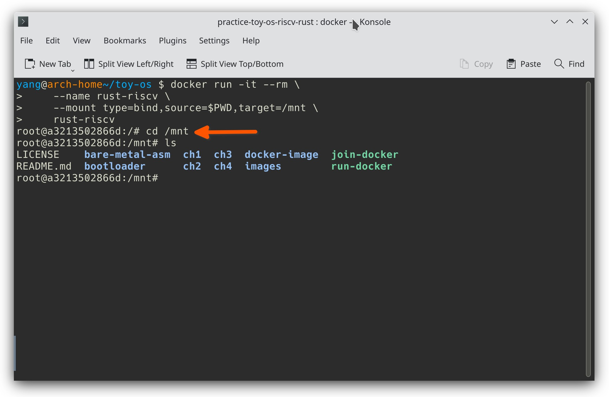
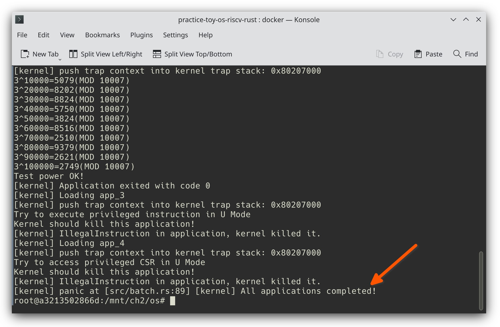

<div align="center">
<h1>Practice Toy OS - rCore</h1>
</div>

本项目是教程 [《rCore-Tutorial-Book 第三版》](https://rcore-os.github.io/rCore-Tutorial-Book-v3/index.html) 的阅读笔记，同时也是一份攻略 😄，原教程讲述了如何一步一步地 **从零开始** 用 Rust 语言写一个基于 RISC-V 架构的 _类 Unix 内核_。

根据原教程的讲解，我将每一章的代码都整理成一个独立的文件夹。你可以一边阅读原教程，一边用你喜欢的代码编辑器切入相应的章节文件夹，试试运行看看运行的结果。

实际上官方也有每个章节的代码 [rCore-Tutorial-v3](https://github.com/rcore-os/rCore-Tutorial-v3)，不过该代码仓库将每个章节的代码组织为 Git 的分支，有时需要同时打开多个章节的代码对比查阅时会稍显不便。另外我也在原来的代码基础上 **添加了些许额外的注释，以及一些扩展资料的链接**。

<!-- @import "[TOC]" {cmd="toc" depthFrom=1 depthTo=6 orderedList=false} -->

<!-- code_chunk_output -->

- [开发环境的搭建和配置](#开发环境的搭建和配置)
  - [在当前系统里配置开发环境](#在当前系统里配置开发环境)
  - [使用 Docker 搭建开发环境](#使用-docker-搭建开发环境)
- [RISC-V 指令和裸机汇编程序](#risc-v-指令和裸机汇编程序)
  - [汇编](#汇编)
  - [链接](#链接)
  - [运行](#运行)
  - [调试](#调试)
  - [深入了解 RISC-V 指令集及工作原理](#深入了解-risc-v-指令集及工作原理)
- [编译和运行各章的代码](#编译和运行各章的代码)
  - [Chapter 1](#chapter-1)
  - [Chapter 2](#chapter-2)
  - [Chapter 3](#chapter-3)
  - [Chapter 4](#chapter-4)
- [参考链接](#参考链接)

<!-- /code_chunk_output -->

## 开发环境的搭建和配置

如果要编译和运行教程的所有程序，开发环境必须有以下工具：

1. Rust
2. Rust 的 `riscv64gc-unknown-none-elf` 编译目标
3. QEMU 7.0
4. RISC-V toolchains

如果不想在当前系统上安装以上工具，也可以在 Docker 里搭建该开发环境。在 Docker 里编译和运行所有程序，教程学习完毕之后把该 Docker Image 删掉即可，对于当前系统来说就像什么事都没发生过一样。

### 在当前系统里配置开发环境

操作系统建议使用 Arch Linux，该发行版的软件包数量巨多而且版本都是最新的，上面提到的工具直接用系统包管理工具安装即可，省去很多麻烦。

如果要在其他发行版或者系统安装，则 [根据教程的指引](https://rcore-os.github.io/rCore-Tutorial-Book-v3/chapter0/5setup-devel-env.html) 下载和安装各个工具即可。

需注意 RISC-V toolchains 的最新版本的仓库地址是 <https://github.com/riscv-collab/riscv-gnu-toolchain>，如果不需要调试程序，不安装这个工具链也可以。

### 使用 Docker 搭建开发环境

准确来说是构建一个 Docker Image，然后 `run` 这个 Image 并在里面完成教程所述的所有程序的开发和运行。如果你不想更改当前的系统，或者安装一些平时用不着的程序，推荐采用 Docker 搭建开发环境这种方式（前提是你得接受在系统里安装 Docker 或者 Podman 😁）。

我在本项目的 `docker-image` 目录里面放置了两个子目录：`mini` 和 `full`，进入其中的一个目录执行命令（或者执行目录当中的脚本 `build-image`）：

`$ docker build -t rust-riscv .`

然后 Docker 会开始构建，构建完成后执行命令：

`$ docker image list`

检查是否存在一项 `rust-riscv`，若存在则表示构建成功。

因为 RISC-V toolchains 的体积较大，所以 `mini` 版默认不安装这个工具链，如果需要安装可以在 Image 构建完成之后，进入该 Container 然后使用下面的命令手动安装：

```bash
$ cd /opt
$ wget https://github.com/riscv-collab/riscv-gnu-toolchain/releases/download/2022.06.10/riscv64-elf-ubuntu-20.04-nightly-2022.06.10-nightly.tar.gz
$ tar xzf riscv64-elf-ubuntu-20.04-nightly-2022.06.10-nightly.tar.gz
$ rm riscv64-elf-ubuntu-20.04-nightly-2022.06.10-nightly.tar.gz
$ echo 'export PATH=/opt/riscv/bin:$PATH' >> ~/.bashrc
$ . ~/.bashrc
```


## RISC-V 指令和裸机汇编程序

现在我们有 RISC-V 的编译工具以及运行和调试程序的模拟器 QEMU，现在可以写最原始的 `Hello World` 程序测试以下，所谓最原始的程序，是指在没有引导程序，没有操作系统的情况下，让机器直接执行指令，这种程序叫做 Bare-metal 程序（裸机程序）。

写这种程序，我们只需一个汇编器，把汇编代码翻译成（二进制指令）目标文件，然后扔给 QEMU 运行即可。极端情况下，比如仅仅想执行几个指令，我们也可以直接写这些指令的二进制到一个文件里，然后把这个文件扔给 QEMU 运行（说笑的，不过的确是可行的）。通过裸机程序，我们可以学习 RISC-V 指令以及基本知识。

### 汇编

新建一个文件，名称为 `first.s`，内容如下：

```asm
.globl _start
_start:
    li s1, 0x10000000 # set s1 = 0x1000_0000
    li s2, 0x41       # set s2 = 0x48
    sb s2, 0(s1)      # set memory[s1 + 0] = s2
```

简单讲解：`.globl _start` 定义个全局 `符号`，类比 "一个库的导出函数（的名称），可供外部查看和调用"，`_start` 定义一个位置，类比 `自动行号`。最后 3 行是 RISC-V 指令，作用看句末的注释。

关于 RISC-V ISA 的基本知识，可以参考 [《RISC-V 手册》](http://riscvbook.com/chinese/RISC-V-Reader-Chinese-v2p1.pdf)，有关指令更详细的资料可以参考 [《RISC-V 规范》](https://riscv.org/technical/specifications/) 以及 [《RISC-V Assembly Programmer's Manual》](https://github.com/riscv-non-isa/riscv-asm-manual/blob/master/riscv-asm.md)。

下面命令将汇编源码汇编（动词）为目标文件：

```bash
$ riscv64-unknown-elf-as -g -o target/first.o first.s
```

`g` 参数用于生成调试信息。

### 链接

新建一个文件，名称为 `default.lds`，内容如下：

```ld
OUTPUT_ARCH(riscv)
ENTRY(_start)
BASE_ADDRESS = 0x80000000;

SECTIONS
{
  . = BASE_ADDRESS;

  .text : {
    *(.text.entry)
    *(.text .text.*)
  }

  .rodata : {
    *(.rodata .rodata.*)
  }

  .data : {
    . = ALIGN(4096);
    *(.sdata .sdata.*)
    *(.data .data.*)
  }

  .bss :{
    *(.sbss .sbss.*)
    *(.bss .bss.*)
  }

}

```

这是一个链接脚本，可见一个常见可执行文件的 `.text`, `.rodata`, `.data`, `.bss` 等段的定义，其中 `BASE_ADDRESS` 用于指定程序的开始位置，之所以值为 0x8000_0000 是因为模拟器程序 `qemu-system-riscv64 -machine virt` 启动后，PC 寄存器的值为 0x1000，也就是说位置 0x1000 的指令将会第一个被执行，通过调试可以发现该处的指令如下：

```asm
0x1000:      auipc   t0,0x0         # set t0 = $pc + sign_extend(immediate[31:12] << 12)
                                    # 现在 t0 == 0x1000，即当前指令的位置
0x1004:      addi    a2,t0,40       # set a2 = t0 + 0x28
                                    # 现在 a2 == 0x1028
                                    # 暂时不用理会
0x1008:      csrr    a0,mhartid     # Hart ID Register (mhartid), 运行当前代码的硬件线程（hart）的 ID
                                    # 现在 a0 == 0
                                    # 暂时不用理会
0x100c:      ld      a1,32(t0)      # set a1 = int64(t0 + 0x20)
                                    # 现在 a1 == 0x87000000
                                    # 可以使用命令 `x/2wx 0x1020` 查看
                                    # 暂时不用理会
0x1010:      ld      t0,24(t0)      # set t0 = int64(t0 + 0x18)
                                    # 现在 t0 == 0x80000000
                                    # 可以使用命令 `x/2wx 0x1018` 查看
0x1014:      jr      t0             # 跳转到 0x80000000
0x1018:              0x0000
0x101a:      .2byte  0x8000
0x101c:              0x0000
0x101e:              0x0000
```

其中 `jr t0` 表示即将会跳到寄存器 `t0` 的值所指向的位置。

用下面的命令链接（动词）得出目标文件：

```bash
$ riscv64-unknown-elf-ld -T default.lds -o target/first target/first.o
```

### 运行

使用 QEMU 运行上一步得到的目标文件：

```bash
$ qemu-system-riscv64 \
    -machine virt \
    -nographic \
    -bios none \
    -kernel target/first
```

应该能看到一个字符 `A` 输出。


按 `Ctrl+a` 然后再按 `x` 退出 QEMU （温馨提示，退出 QEMU 不是按 `Ctrl+x`，也不是 `:q`）

### 调试

在运行 QEMU 的命令后面加上 `-s -S` 能启动 GDB 调试服务端，

```bash
$ qemu-system-riscv64 \
    -machine virt \
    -nographic \
    -bios none \
    -kernel target/first -s -S
```

打开另外一个终端窗口，运行下面命令进入 GDB 调试客户端

```bash
$ riscv64-elf-gdb
```

进入后输入 `target remote :1234` 连接服务端。

**调试命令**

- 命令 `x/10i $pc`

查看 $pc 位置的 10 条指令，命令 `x` 用于查看内存



- 命令 `si`

逐条指令运行

- 命令 `b *0x80000000`

设置断点

- 命令 `c`

可以持续运行程序直到遇到断点

- 命令 `p/d $x1`

打印 x1 寄存器的数值

- 命令 `p/x $sp`

同样也是打印寄存器的数值，以 16 进制格式打印

- 命令 `i r`

列出所有寄存器的值。

- 命令 `q`

退出调试环境

输入命令 `help` 获取各个命令的帮助信息，比如：

`help info`

会列出 `info` 命令的详细用法。如果有时忘记命令的完整名称，可以在输入前面的一两个字符时，按下 `tab` 键列出提示或者自动补完，比如输入 `info reg` 按下 `tab` 键，会自动补完为 `info registers`。

对于高频次使用的命令，只需输入命令的第一个字符即可，比如 `info` 可以输入 `i` 代替，同样 `i registers` 可以输入 `i r` 代替。

> 注，在 GDB 里是没法直接输入和执行 RISC-V 指令的，所以如果想要测试一些 RISC-V 指令，需要编写一个简单的汇编程序，然后再使用上述的步骤运行和调试。

"Hello world!" 程序的代码在 [bare-metal-asm/hello.s](bare-metal-asm/hello.s)。

### 深入了解 RISC-V 指令集及工作原理

可以借助图形化的 RISC-V CPU 模拟工具用于学习和实践 RISC-V 的指令集，下面推荐两个：

- QtRVSim
  https://github.com/cvut/qtrvsim

- RARS
  https://github.com/TheThirdOne/rars

比起 QEMU，它们能够比较直观地显示程序、内存、寄存器的内容，甚至能够显示 RTL 级（寄存器级，可以简单地认为是数字电子电路） CPU 状态。有直观的工具辅助学习，往往可以事半功倍。


## 编译和运行各章的代码

> 以下内容请按顺序阅读和运行，即必须先完成第一章的每一个步骤，才能进入第二章，如此类推。

在开始编译和运行各章的代码之前，首先切换到本项目的首层目录，然后你会看到诸如 `ch1`，`ch2`，`ch3` …… 等子目录，它们对应着各章的程序。

如果你是 Docker 的开发环境，进入本项目的首层目录后运行命令：

```bash
docker run -it --rm \
    --name rust-riscv \
    --mount type=bind,source=$PWD,target=/mnt \
    rust-riscv

```

该命令会创建一个容器，进入之后是一个 Bash shell，切换到 `/mnt` 目录即可看到 `ch1`，`ch2` …… 等子目录，这时候跟在当前系统里直接搭建的开发环境是一致的。



### Chapter 1

1. 进入 `ch1` 目录
2. 运行脚本 `build-bin` 开始编译
3. 运行脚本 `run` 运行程序，看到 `panic at (src/main.rs:86) Shutdown machine!` 字样则表示成功。

> 这些脚本只是为了简化命令，大部分脚本的内容都是非常简单的。如果你想知道脚本里面具体执行了什么，可以用文本编辑器打开查看。


教程第一章里有一个使用 GDB 进入调试环境的环节，这个步骤可以跳过。如果你还是想完整体验完所有环节，则运行脚本 `start-debug-server` 开始调试的服务端，接下来则根据开发环境的不同而不同：

* 对于在当前系统直接进行开发的，打开另一个终端窗口，然后在里面运行 `ch1` 目录当中的脚本 `start-debug-client-archlinux`。
* 对于在 Docker 里面进行开发的，打开另一个终端窗口，然后在里面运行本项目首层目录当中的脚本 `join-docker`，进入到刚才的容器，切换到 `/mnt` 目录，然后进入 `ch1` 目录，再运行脚本 `start-debug-client-docker`。

> 注：运行成功只是为了确认代码能符合预期地运行，但学习的目标并不是把所有章节的程序跑一遍，而是对照教程一遍看代码一边学习和理解，下同

> 注：如果你完全不知道这章的内容在讲什么，建议在此暂停一下，你可能需要先补充一些预备的知识，这里推荐一些资料：《深入理解计算机系统/CS:APP3e》、《计算机组成与设计——硬件软件接口——RISCV版》、《UNIX 环境高级编程/APUE》、《Programming from the Ground Up: An Introduction to Programming using Linux Assembly Language》

### Chapter 2

1. 进入 `ch2` 目录
2. 进入 `user` 目录
3. 运行脚本 `build-app` 开始编译 5 个用户应用程序
4. 运行脚本 `run` 会通过用户态模拟器 `qemu-riscv64` 来运行刚才编译出的应用程序。注意几个程序运行之后会显示错误信息，这是正常的，能看到 `Hello, world!` 和 `Test power OK!` 字样则表示成功。
5. 返回上一级目录，进入 `os` 目录
6. 运行脚本 `build-bin` 开始编译
7. 运行脚本 `run` 运行程序，看到 `All applications completed!` 字样则表示成功。



### Chapter 3

::TODO

### Chapter 4

::TODO

## 参考链接

- 《Writing an OS in Rust》
  Blog OS
  https://os.phil-opp.com/
  https://github.com/rustcc/writing-an-os-in-rust

-
  https://osblog.stephenmarz.com/index.html

- 《Rust Raspberry Pi OS》
  https://github.com/rust-embedded/rust-raspberrypi-OS-tutorials

- 《OS from scratch》
  C 语言, x86
  https://github.com/cfenollosa/os-tutorial
  https://www.cs.bham.ac.uk/~exr/lectures/opsys/10_11/lectures/os-dev.pdf
  https://littleosbook.github.io/

- 《Xv6 - RISC-V》
  C 语言
  https://pdos.csail.mit.edu/6.828/2021/xv6.html

- 《rCore》
  http://rcore-os.cn/rCore-Tutorial-Book-v3/index.html
  https://github.com/skyzh/core-os-riscv.git

- OSDev.org
  https://wiki.osdev.org/Main_Page
